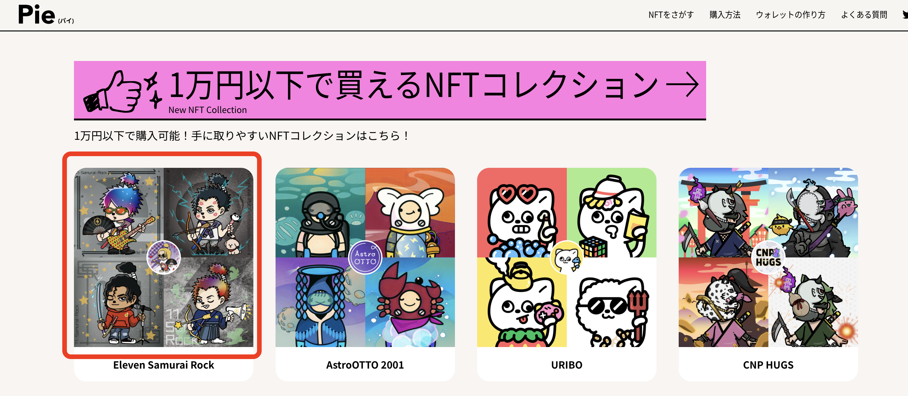
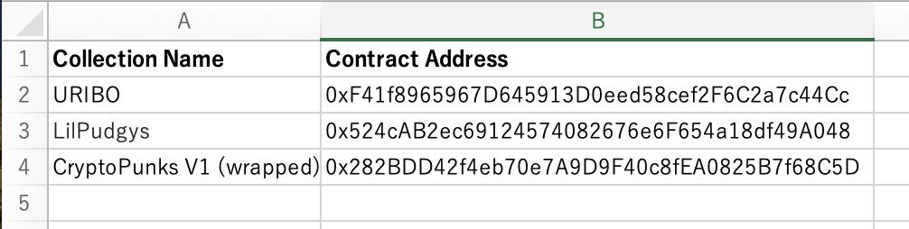
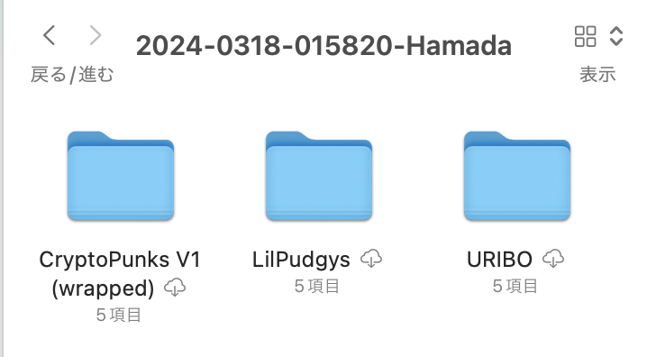
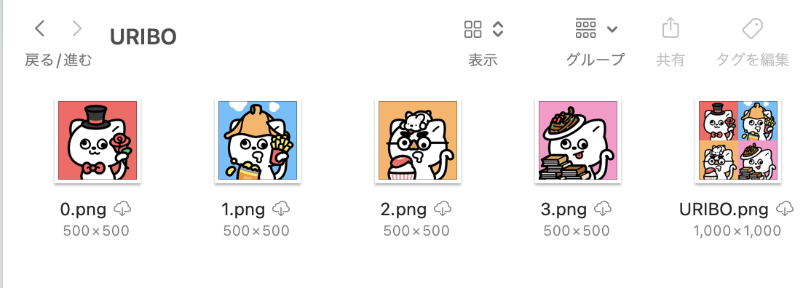

# nft-data-generator-api


## 4つ並びのコレクション画像を生成

日本向けNFTマケプレ[Pie](https://getpie.xyz/) で使われる 4つ並びのコレクション画像 を生成する。

| Pie 4つ並びコレクションの画像 |
| --- |
|  |


生成に エクセル を使用する。
エクセルに書かれた **コレクション名** や **コントラクトアドレス** をもとにしてコレクション画像を生成していく。
生成に必要なデータを [ReserviorAPI](https://docs.reservoir.tools/reference/getcollectionsv7) から取得する。

| エクセル | 生成されるフォルダ | コレクション画像 |
| --- | --- | --- |
|  |  |  |

### 実行

**【任意】1 : 対象コレクションの名称とコントラクトアドレスを取得**

[Etherscan](https://etherscan.io/) を用いると簡単に取得できる

**【任意】2 : エクセルに追記**

**3 : プログラム実行**

```.bash
$ pip install -r requirments.txt
$ python CollectionImageGenerator.py
```
